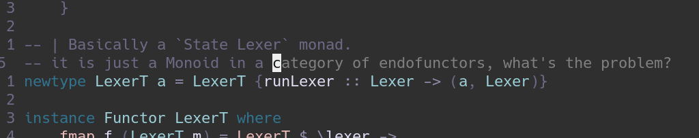

<div align="center">

# MonkeyLang Interpreter in Haskell

##### Haskek tutorial



</div>

## Quickstart

To test the application you can use the Makefile commands as described in the
repo readme.

```console
make docker-ready
```

Small cli tool that allows to switch between the different lexer
implementations and tokenize from stdin. (basic, monad, state, parsec)

```console
cat program.monkey | cabal run haskell basic
```

## Tools used

- [Fourmolu](https://hackage.haskell.org/package/fourmolu) to format code
- [HLint](https://hackage.haskell.org/package/hlint) to check code
- [Cabal](https://hackage.haskell.org/package/Cabal) the build tool

## Implementation

Some useful things to know before the implementation

### [Data.ByteString.Char8](https://hackage.haskell.org/package/bytestring-0.11.4.0/docs/Data-ByteString-Char8.html)

Haskell `String` type is actually a linked list of `Char`. This is not very
performant, e.g., `length` and indexing `(!!)` operations are O(N). Also,
indexing is unsafe (can "panic"). `ByteString` is an alternative to the
standard `String`. With this data type we have O(1) operations and built in
safe indexing `(!?)` that return `Maybe` types (`Option` in Rust).


For this reason I have created a type alias that I used in my implementation

```haskell
type Input = ByteString
```

### Token

I created a separate Token module to help with having the same format across
different implementations of lexers.

In this module we can define our Token enum. We can do that with the `data`
keyword like so

```haskell
data Token
    = Illegal
    | Eof
    | Ident String
    ...
    deriving (Show, Eq)
```

this is equivalent to the Rust code

```rust
#[derive(Debug, PartialEq, Eq)]
enum Token {
    Illegal,
    Eof,
    Ident(String),
    ...
}
```

This basically means that we have a data type called `Token` which has (in this
example) 3 constructors, `Illegal`, `Eof` and `Indent`. The `Ident` constructor
can also hold a `String` value as a container.

```haskell
>>> myIllegalToken :: Token = Illegal
>>> myIdentToken :: Token = Ident "myIdent"
-- :: Token is not required, but it helps to visualize the type
```

Next we can define a common type for our lexing function. We want a function
that will take in a `String` and return a list of tokens `[Token]`. I decided
to not require a `ByteString` here, because we can convert the `String`
internally and not have the user of this library concern with the input type.

This means that we are going to have a function `tokenize` at some point with
the following definition

```haskell
tokenize :: String -> [Token]
```

To enforce the rule that all implementations will have this type we can create
a type alias for this function like this

```haskell
type Tokenizer = String -> [Token]
```

and now we can do

```haskell
tokenize :: Tokenizer
```

which is the same thing.

We can also add here some helper functions, for example we can implement a
function that checks if a character `Char` is part of an identifier or not. In
the book they use `a-zA-Z_`. In Haskell we can use the `==` function to check
if two things are equal. And the `||` function to perform the `or` operation on
truth values, like any other language.

For example we can try to implmenet the `isIdentChar` like this

```haskell
isIdentChar :: Char -> Bool
isIdentChar c = c == 'a' || c == 'b' ...
```

however this is to difficult to maintain, so we can also make use of a range

```haskell
>>> ['a'..'z']
"abcdefghijklmnopqrstuvwxyz"
```

this is equivalent to doing a range in Rust like this `('a'..='z')`. In Haskell
the ranges are inclusive by default, not the best in my opinion, but it is what
it is. Next we need to check if the character is in this generated `String`. We
can use `elem` for this

```haskell
isIdentChar c = elem c ['a'..'z'] || elem c ['A'..'Z'] || c == '_'
```

We can also use the infix notation (or however it is called) to convert a
function into an operator

```haskell
isIdentChar c = c `elem` ['a'..'z'] || c `elem` ['A'..'Z'] || c == '_'
```

now instead of taking the arguments from the next two positions, `elem` will
take them from the lefthand side and righthand side.

To make everything cleaner we have a function `isLetter` in `Data.Char` module
that checks if a character is `a-zA-Z`

```haskell
isIdentChar :: Char -> Bool
isIdentChar c = isLetter c || c == '_'
```

Next let's implement a function that will take in a `String` value and will
return a `Token` that represents the given keyword or identifier. It is
basically a map from a string to a token. We can do that in Haskell by using
the usual `if ... else` statements that everyone is familiar with. First let us
imagine that we only care about "fn", "let" and identifiers

```haskell
identToken :: String -> Token
identToken ident = if ident == "fn" then Function else if ident == "let" then Let else Ident x
```

we can see that this can get out of hand really quickly, so as many other
languages Haskell has a switch kind of statement `case ... of`

```haskell
identToken :: String -> Token
identToken ident = case ident of
    "fn" -> Function
    "let" -> Let
    x -> Ident x
```

this looks nice and is easier to maintain, but I prefer to use pattern matching
when possible

```haskell
identToken :: String -> Token
identToken "fn" = Function
identToken "let" = Let
identToken x = Ident x
```

this is pretty much the same as the one above, but we explicitly define a
function for each case. Haskell will try each one from top to bottom until one
matches and then it will execute it.

### Lexer.Book

`Lexer.Book` shows how one would implement the lexer by following the book.
Book.hs is a module that will export a `tokenize` function.

First we need to define the data structure that will hold the lexer. We can do
this by using the `data` keyword

```haskell
data Lexer = Lexer Input Int Int Char
```

then, to create a new Lexer we can create a function that takes in an Input and
returns a Lexer.

```haskell
newLexer :: Input -> Lexer
newLexer input = Lexer input 0 0 '\0'
```

however this is not very intuitive, what does each `Int` mean and what is the
`Char`? Because of this we can actually use a more verbose way of defining this
data type by using records

```haskell
data Lexer = Lexer
    { input :: Input      -- The input string
    , position :: Int     -- The position of the cursor
    , readPosition :: Int -- The position of the reading head
    , ch :: Char          -- The current character
    }
```

and the syntax to instantiate the structure (very similar to Rust btw) is like this

```haskell
newLexer :: Input -> Lexer
newLexer input =
    Lexer
        { input = input
        , position = 0
        , readPosition = 0
        , ch = '\0'
        }
```

With this definition we will be able to access the fields of a lexer using the
record names. For example lets say that we have a `lexer :: Lexer`, then we can
access the input by doing `input lexer`, or we can use `readPosition lexer` to
get the readPosition. We can even craft a more complex example, lets say

```haskell
input lexer !? readPosition lexer
```

which would return the lookahead character. This is similar to indexing in a list

```rust
lexer.input[lexer.readPosition]
```

or to be more precise it would be the same as

```rust
lexer.input.get(lexer.readPosition)
```

because it returns an optional value, in Haskell it is called `Maybe`.

With this information we can try to build a `peek` function. This will be
responsible for giving us the character that is under the reading head, or the
null `\0` character if we are outside of the bounds. This function will receive
the Lexer as an argument and it will return a character.

```haskell
peek :: Lexer -> Char
```

Right now we know how to index the ByteString and get a Maybe of out it. But
how do we extract the Char from the optional? For this we can use a `case ...
of` statement.

```haskell
case input lexer !? readPosition lexer of
    Just c -> c
    Nothing -> '\0'
```

Similar to how Option in Rust has two constructors (Some and None), the Maybe
type in Haskell has two as well one called `Just` that holds the value (Some)
and an empty one `Nothing` (None).

There is however a shorter way of writting this, by using the `fromMaybe`
function, located in `Data.Maybe`. This function takes a default value and a
Maybe value and will work exactly as the case from above. (`unwrap_or`)

Now we can finally write the function as

```haskell
peek lexer = fromMaybe '\0' (input lexer BS.!? readPosition lexer)
```

Now let us try to create a function that takes in a lexer and gives us a token.
(imagine that we only care for the left squirly for now and don't have
whitespace)

```haskell
nextToken :: Lexer -> Token
nextToken lexer = case ch lexer of
    '{' -> LSquirly
    _ -> Illegal
```

```haskell
>>> nextToken (newLexer "hi")
Illegal
>>> nextToken (newLexer "{hello}")
LSquirly
```

so if we find a left squirly we return the `LSquirly` type otherwise we return
`Illegal`. But what if we want the token after this one? If we call nextToken
again on the lexer we would get the same result twice

```haskell
>>> lexer = newLexer "{hello}"
>>> nextToken lexer
LSquirly
>>> nextToken lexer
LSquirly
```

To understand how to tackle this issue lets try to implement the `advance`
function. This function will move the cursor of the lexer one position forward.
It will basically take in a `Lexer` and return a new one with the fields
changed.

```haskell
advance :: Lexer -> Lexer
```

In Haskell the variables are immutable, this means that the functions will
create new instances (clone) each time they are called. If we want to update
the values inside a structure we need to copy all the fields and instantiate a
new one. So advance will looks like this

```haskell
advance lexer =
    Lexer
        { input = input lexer
        , position = readPosition lexer
        , readPosition = readPosition lexer + 1
        , ch = peek lexer
        }
```

however copying each field can be tedious in large structures, so there is some
syntactic sugar which allows you to not specify all fields by doing an
"update" on the `lexer` argument (or binding in FP world)

```haskell
advance lexer =
    lexer
        { position = readPosition lexer
        , readPosition = readPosition lexer + 1
        , ch = peek lexer
        }
```

still not great but it can be useful to know this trick.

Now we can try to implement our `nextToken` function in terms of `advance`, so
we just need to make the nextToken function return both the token and the next
lexer. We can use tuples for that

```haskell
nextToken :: Lexer -> (Token, Lexer)
nextToken lexer = case ch lexer of
    '{' -> (LSquirly, advance lexer)
    _ -> (Illegal, advance lexer)
```

Now if we take the example from before

```haskell
>>> nextToken (newLexer "hi")
Illegal
>>> lexer = newLexer "{hello}"
>>> (token, lexer) = nextToken lexer
>>> token
LSquirly
>>> (token, lexer) = nextToken lexer
>>> token
Illegal
```

we can see that we can actually move the lexer forward. Altough it is pretty
tedious to do it by hand. Lets try to make a recursive function that runs until
eof. This function will return a list of tokens `[Token]` instead of just a
single one (like nextToken does)

```haskell
go :: Lexer -> [Token]
```

As we have seen, the first thing to do is to get the next token using
`nextToken lexer`. A useful statement in Haskell is `let ... in` which allows
you to define a variable in the `let` block and then use it in the `in` block

```haskell
go lexer = let (token, lexer') = nextToken lexer
           in undefined
```

now instead of undefined we need to add our base case and the recursive call,
as we said, if we find the `Eof` token we stop, this will be the base case


```haskell
-- we return [Eof] at the end because this is how it is done in the book
go lexer = let (token, lexer') = nextToken lexer
           in if token == Eof then [Eof] else undefined
```

but how do we recursively build the list of tokens? Let us imagine that the go
function is done, and we just call it like so

```haskell
>>> tokens = go lexer
```

you can prepend a new token to `tokens` by using the cons (:) function

```haskell
>>> LSquirly : tokens
[LSquirly, ........]
```

with this in mind we can actually replace the `undefined` with `token : go lexer'`

```haskell
go lexer = let (token, lexer') = nextToken lexer
           in if token == Eof then [Eof] else token : go lexer'
```

Now to integrate the `go` function with our `Tokenizer` type we can do the following
(don't forget to call advance once, aka read the book)

```haskell
-- pack is part of ByteString and it converts from String to ByteString
tokenize :: Tokenizer
tokenize input = go (advance (newLexer (pack input)))
```

here we `pack` the `String` input into a `ByteString`, then we build a `Lexer`,
then we advance the lexer one position and then we run the tokenizer to get the
list of tokens.

We can also write this in a prettier way by using `$` instead of (...)

```haskell
tokenize :: Tokenizer
tokenize input = go $ advance $ newLexer $ pack input
```

and to be cool haskelers we can do an Eta reduction and use `.`

```haskell
tokenize :: Tokenizer
tokenize = go . advance . newLexer . pack
```

We can also we `case ... of` instead of if else and write the function like this

```haskell
tokenize :: Tokenizer
tokenize = go . advance . newLexer . BS.pack -- you can qualify imports to have "namespaces"
  where
    go lexer = case nextToken lexer of
        (Eof, _) -> [Eof]
        (token, lexer') -> token : go lexer'
```

The `where` syntax is the reverse of `let ... in`, it allows you to use a thing
in the current block that you will define in the where statement (or at least
this is how I viewed it the first time I saw it and stick with it).

Next we can define more helper functions. For example `skipWhitespace` which
will advance the lexer while we encounter whitespace characters. We also have a
`readIdent` function that will read while it find an identifier character
(a-zA-Z_). And the last one is `readInt` which will read while it find a digit
(0-9). (I will probably do the rest at some point)

```haskell
skipWhitespace :: Lexer -> Lexer      -- create a new lexer that has all the whitespace consumed
readIdent :: Lexer -> (String, Lexer) -- gives us an identifier as a `String` and the lexer with the input consumed
readInt :: Lexer -> (String, Lexer)   -- same but for int literals
```

Keeping in mind all the whitespaces and more tokens the `nextToken` function
would look like this

```haskell
nextToken :: Lexer -> (Token, Lexer)
nextToken lexer = (token, lexer'')                            -- return the token and the lexex that we will define in where
  where
    lexer' = skipWhitespace lexer                             -- create a new lexer that starts with an interesting character
    (token, lexer'') =
        case ch lexer' of
            '{' -> (LSquirly, advance lexer')

            '!' ->                                            -- if we find a `bang`
                if peek lexer' == '='                         -- we peek and check if the next character is `=`
                    then (NotEqual, advance $ advance lexer') -- if yes we return `NotEqual` and have to advance twice on `lexer'`
                                                              -- once for `!` and once for `=`
                    else (Bang, advance lexer')               -- otherwise we just have a `Bang`

            c | isIdentChar c ->                              -- if we have a character `c` that satisfies `isIdentChar c`
                    let (str, lexer''') = readIdent lexer'    -- we do `readIdent` and get a string and a new lexer (''' why? crying)
                     in (identToken str, lexer''')            -- and we use our mapping from the beginning to return the right Token

            _ -> (Illegal, advance lexer')                    -- otherwise it is an illegal token, but we still have to advance
```

You can see how manually handling the lexer can be very painful. I usually like
to use `apostrophe` in the name to indicate a new one (how one might do
variable1, variable2, etc), but at some point it becomes hard to keep track
which one you have to use.

### Lexer.Monad

The issue that we had in the Book implementation is that it is really hard to
keep track of each instance of the Lexer in the nextToken function. We want
something like

```rust
impl Lexer {
    next_token(&mut self) -> Token {
        // do whatever
    }
}
```

We still need part of our old code for this implementation

```haskell
type Input = ByteString

data Lexer = Lexer
    { input :: Input
    , position :: Int
    , readPosition :: Int
    , ch :: Char
    }

newLexer :: Input -> Lexer
newLexer input =
    Lexer
        { input = input
        , position = 0
        , readPosition = 0
        , ch = '\0'
        }
```

Previously, we had a `nextToken` function that was taking in a Lexer and was
outputing a (Token, Lexer) tuple. We want to abstract this type in a Monad. I
know "it is just a monoid in the category of endofunctors, what's the problem?".

First we define a data type that will store the function.

```haskell
data LexerT = LexerToken { runLexer :: Lexer -> (Token, Lexer) }
```

But what if we want to tokenize a list of tokens, or return a string, or unit
`()`? We would have to define a constructor for each type.

```haskell
data LexerT = LexerToken { runLexer :: Lexer -> (Token, Lexer) }
            | LexerTokens { runLexer :: Lexer -> ([Token], Lexer)}
            | LexerString { runLexer :: Lexer -> (String, Lexer)}
            | LexerUnit { runLexer :: Lexer -> ((), Lexer)}
```

if you can see a pattern here you are right. We can actually make use of
generics (suck on that Go) to not have to write each constructor manually

```haskell
newtype LexerT a = LexerT { runLexer :: Lexer -> (a, Lexer)}
```

Now we can have a runLexer for any type of a, we can have `LexerT Token` that
parses a single token, `LexerT [Token]` that parses a list of tokens, etc. We
can also use `newtype` instead of `data` because we have a single constructor
with a single field (this allows for some optimizations I think, because it can
be considered just a simple function).

This is the same as you would define a generic structure in Rust

```rust
struct LexerT<T> {
    runLexer: impl Fn(Lexer) -> (T, Lexer);
}
```

Lets say that we have a function `parseInt :: LexerT String` and we want to
convert the `String` to a `Token`, basically change the type from `LexerT
String` to `LexerT Token`. We can do this by running the lexer, looking inside
the tuple, building a new tuple and return it. It would be something like this

```haskell
>>> lexer = newLexer ... blah blah ...
>>> (value, lexer') = runLexer parseInt lexer
>>> result = (Int value, lexer')
```

wait... that is just what we were doing before. Lets try to make this easier by
implementing `Functor` for our data type (I have no idea how to make this
friendly for beginners but)

To implement the Functor class we need to define the `fmap` function. Similar
to how we implement traits in Rust. This function take as arguments a function
and a functor and applies the function on the inside value and will return the
functor, but with the inside changed.

```haskell
instance Functor LexerT where
    fmap f (LexerT m) = LexerT $ \lexer ->
        let (a, lexer') = m lexer
         in (f a, lexer')
```

- `f` is our function
- `m` is the record of the `LexerT` type, which is the `runLexer` function
- `LexerT` we have to create a new LexerT functor
- `\lexer -> ...` is a lambda function that takes in a `Lexer` and will return
  us a tuple; this lambda will be the new record of the functor
- `let (a, lexer') = m lexer` will run the lexer and give us the results, an
  `a` and the new lexer `lexer'`
- `in (f a, lexer')` applies the function `f` on the the result `a` and returns
  the tuple

With this class implemented we can write the code from above as

```haskell
>>> lexer = newLexer ... blah blah ...
>>> result = runLexer (fmap Int parseInt) lexer
```

this can also be rewritten as

```haskell
>>> lexer = newLexer ... blah blah ...
>>> result = runLexer (Int <$> parseInt) lexer
```

to use the operator `(<$>)` instead of the function `fmap`.

Next thing. Say that you have a `stringP :: LexerT String` a `charP :: LexerT
Char` and you want to prepend the `Char` to the `String`. Well, we know that we
can inject a function into a functor, but how to combine them

```haskell
>>> lexer = newLexer ... blah blah ...
>>> charPWithFunction :: LexerT (String -> String) = (:) <$> charP
>>> (theFunction, lexer') = runLexer charPWithFunction lexer
>>> (string, lexer'') = runLexer stringP lexer'
>>> result = (theFunction string, lexer'')
```

intuitively this is what we were doing before, in the Book implementation. To
not have to do this manually each time we can implement the `Applicative`
class, which requires two function, `pure` and `<*>`

```haskell
instance Applicative LexerT where
    pure a = LexerT $ \lexer -> (a, lexer)
    (<*>) (LexerT mf) (LexerT ma) = LexerT $ \lexer ->
        let (f, lexer') = mf lexer
            (a, lexer'') = ma lexer'
         in (f a, lexer'')
```

- `pure` takes in a `thing` and creates a `LexerT` that always returns that thing
- `<*>` does all the stuff that we did manually above
- `mf` (yes, I know you read it m**er) is the Functor with the function
- `ma` is the functor with the value
- `let (f, lexer') = mf lexer` we get the function and the new lexer
- `(a, lexer'') = ma lexer'` then we get the value and the new new lexer (see how it saves us from dealing with '''?)
- `in (f a, lexer'')` runs the function f on the result a and returns the new new lexer

So now we can rewrite the thing from above as

```haskell
>>> lexer = newLexer ... blah blah ...
>>> charPWithFunction :: LexerT (String -> String) = (:) <$> charP
>>> result = runLexer (charPWithFunction <*> stringP) lexer
```

or even more concise

```haskell
>>> lexer = newLexer ... blah blah ...
>>> result = runLexer ((:) <$> charP <*> stringP) lexer
```

For Monad I don't really have an explanation of why we need it, other than it
allows us to use `do` notation. Monad only requires a single function to be
implemented `>>=` (bind). I am not very experienced with monads, but from what
I know it is used to sequence together multiple monads.

```haskell
instance Monad LexerT where
    (LexerT m) >>= k = LexerT $ \lexer ->
        let (a, lexer') = m lexer
         in runLexer (k a) lexer'
```

- `>>=` takes in a monad `LexerT a` and a function `k` that build a monad from a value
- `let (a, lexer') = m lexer` as usual we run the lexer and get the result and the new lexer
- `k a` here we build a new monad from `a` using `k`
- `in runLexer (k a) lexer'` we run again the lexer with the new monad

You can think of `>>=` as doing

```haskell
main = monad >>= function
main = do
    myThing <- monad
    function myThing
```

and of `>>` (Because we implemented `>>=` in Monad we get `>>` for free is like
default functions on Traits) as doing

```haskell
main = monad >> function
main = do
    _ <- monad -- discards the result
    function
```

You might say that this is very similar to functor and yes, it just runs the
lexer at the end again in this one. I guess this is why the meme quote. But now
we can use `do` with our `LexerT` type.

We can build the peek function in terms of `LexerT` now. This will return a
value of `Char` when executed.

```haskell
peek :: LexerT Char
peek = LexerT $ \lexer -> (fromMaybe '\0' $ input lexer BS.!? readPosition lexer, lexer)
```

The logic of getting the character stays the same, but we need to add some
boilerplate code to make it easier later.

Lets also implement a getter for the `Char` inside the `Lexer`

```haskell
current :: LexerT Char
current = LexerT $ \lexer -> (ch lexer, lexer)
```

And also the advance function

```haskell
advance :: LexerT ()
advance = LexerT $ \lexer ->
    ( ()
    , lexer
        { position = readPosition lexer
        , readPosition = readPosition lexer + 1
        , ch = fromMaybe '\0' $ input lexer BS.!? readPosition lexer
        }
    )
```

Now we also need to reimplement the helper function from before

```haskell
skipWhitespace :: LexerT ()
readIdent :: LexerT String
readInt :: LexerT String
```

And finally we can rewrite `nextToken`

```haskell
nextToken :: LexerT Token
nextToken = do
    skipWhitespace                                     -- skip the whitespace
    ch <- current                                      -- get the current character
    case ch of
        '{' -> LSquirly <$ advance                     -- if it is { then return LSquirly and advance the lexer

        '!' -> do
            p <- peek                                  -- peek the lookahead character
            if p == '='
                then NotEqual <$ advance <* advance    -- if it is `=` we return `NotEqual` and advance twice (same reason as before)
                else Bang <$ advance                   -- otherwise we return `Bang` and advance once

        c | isIdentChar c -> identToken <$> readIdent  -- if we have an identifier character we read the string ident
                                                       -- and then convert it to Token using the mapping
                                                       -- no need to advance here because readIdent will advance for us

        _ -> Illegal <$ advance                        -- otherwise it is an illegal token and we advance
```

this is much easier to read and maintain.

To implement the tokenize function let's look again at the `go` function

```haskell
go :: LexerT [Token]
go = do
    token <- nextToken         -- get the next token
    case token of
        Eof -> pure [Eof]      -- if the token is `Eof` then we just create a LexerT that returns `[Eof]` when executed

        _ -> (token :) <$> go  -- otherwise we need to prepend the current token to the result of calling `go` again
                               -- but since go returns a `LexerT [Token]`, which is a functor, we have to inject the
                               -- `(token :)` that we used in the Book implementation with `fmap` into the LexerT
```

you can see that `lexer'` is not longer needed in this case.

Finally we can implement the tokenize function

```haskell
tokenize :: Tokenizer
tokenize =
    fst                                  -- 5. we take the first element in the tuple since runLexer
                                         -- returns the tokens and the new lexer
        . runLexer                       -- 4. we run the lexer
            (advance >> go)              -- 3. we advance once the lexer and then run go on it
        . newLexer                       -- 2. we build the Lexer with the input
        . BS.pack                        -- 1. we pack the String into ByteString
```

### Lexer.State [Control.Monad.State](https://hackage.haskell.org/package/mtl-2.3.1/docs/Control-Monad-State-Class.html)

Instead of implementing the instances of Functors and Monads manually, we can
actually use the package [mtl](https://hackage.haskell.org/package/mtl). This
includes monad classes that would be useful to us.

For example the `State` monad, which is what we implemented with `LexerT`.

There are a few differences however, mostly in the naming of the functions. We
will need to import the `import Control.Monad.State` module.

First we have to change the `LexerT` to a type alias

```haskell
type LexerT = State Lexer
```

Then in `tokenize` the `runLexer` needs to be replaced by `runState`

```haskell
tokenize :: Tokenizer
tokenize = fst . runState (advance >> go) . newLexer . BS.pack
```

but there is an even better one, `evalState`, which does the `fst` for us

```haskell
tokenize :: Tokenizer
tokenize = evalState (advance >> go) . newLexer . BS.pack
```

Then `nextToken` stays the same. So we go to `peek` next

```haskell
peek :: LexerT Char
peek = do
    input <- gets input
    readPosition <- gets readPosition
    pure $ fromMaybe '\0' $ input BS.!? readPosition
```

which makes use of the `gets` function of the `State` if you want to compare to
how I would write the `Lexer.Monad` version in do notation here it is

```haskell
peek :: LexerT Char
peek = do
    let getInput = input
    let getReadPosition = readPosition
    LexerT $ \lexer -> (fromMaybe '\0' $ getInput lexer BS.!? getReadPosition lexer, lexer)
```

Next the `current` function

```haskell
current :: LexerT Char
current = gets ch
```

will be just a call to `gets`, pretty much how the Lexer.Monad implementation
was. And the last one is `advance`

```haskell
advance :: LexerT ()
advance = modify $ \lexer ->
    lexer
        { input = input lexer
        , ch = fromMaybe '\0' $ input lexer BS.!? readPosition lexer
        , position = readPosition lexer
        , readPosition = readPosition lexer + 1
        }
```

which uses `modify` also a function from `State` that takes as input a function
`State -> State`. It basically creates a new state from the current one, based
on the lambda function that we provided.

Now we also need to copy the helper function from before, since they will be
the same.

### Lexer.Lens [Control.Lens](https://hackage.haskell.org/package/lens-5.2.2/docs/Control-Lens.html)

Record syntax in Haskell is not very user friendly. Reading and updating fields
is verbose and using lenses makes it more like to to other languages where
`recored^.field` is equivalent to `record.field` and `record & field .~ value`
is equivalent to `let mut temp = record.clone(); temp.field = value; temp`

For example given a record

```haskell
  Lexer
    { input        :: String
    , position     :: Int
    , readPosition :: Int
    , ch           :: Char
    }
```

if we have a lexer record

```haskell
lexer = Lexer { input = "input", position = 0, readPosition = 0, ch = 'a' }
```

and we wanted to increment the `position` field we would have to do something like

```haskell
lexer' = lexer { position = position lexer + 1 }
```

and we wanted to increment the `readPosition`  field we would have to do

```haskell
lexer' = lexer { readPosition = readPosition lexer + 1 }
```

and if we wanted to update the `ch` field to a 'b' we would have to do something like

```haskell
lexer' = lexer { ch = 'b' }
```

and if we wanted to replace the `input` field with only its first two characters (unsafe) we would have to do something like

```haskell
lexer' = lexer { input = take 2 (input lexer) }
```

so this entire update was

```haskell
lexer' = lexer { input = take 2 (input lexer), position = position lexer + 1, readPosition = readPosition lexer + 1, ch = 'b' }
```

with lenses we can do this

```haskell
lexer' = lexer & input %~(take 2) & position +~1 & readPosition +~1 & ch .~ 'b'
```

This seems trivial here but when if we have a record with many fields it
becomes very verbose and hard to read particularly with nested records.

In our code we can do the following (we need to enable `{-# LANGUAGE TemplateHaskell #-}`)

```haskell
type Input = ByteString

data Lexer = Lexer
    { _input :: Input
    , _position :: Int
    , _readPosition :: Int
    , _ch :: Char
    }

makeLenses ''Lexer
```

Most of the functions will stay the same, however we need to change the
`newLexer` function since we change the structure of Lexer

```haskell
newLexer :: Input -> Lexer
newLexer i = Lexer
    { _input = i
    , _position = 0
    , _readPosition = 0
    , _ch = '\0'
    }
```

The `peek`, `current` and `advance` functions will look like the following

```haskell
peek :: LexerT Char
peek = do
    lexer <- get
    pure $ fromMaybe '\0' ((lexer ^. input) BS.!? (lexer ^. readPosition))

current :: LexerT Char
current = do
    lexer <- get
    pure $ lexer ^. ch

advance :: LexerT ()
advance = modify $ \lexer ->
    lexer
    & ch .~ fromMaybe '\0' ((lexer ^. input) BS.!? (lexer ^. readPosition))
    & position .~ lexer ^. readPosition
    & readPosition +~ 1
```

and this represents the only major change. I guess it is more of a prefernce,
which one you like more.

Personally I prefer to use `{-# LANGUAGE RecordWildCards #-}`, rather than
lens, which allows you to do the following

```haskell
advance :: LexerT ()
advance = modify $ \lexer@Lexer{..} ->
    lexer
        { input = input
        , ch = fromMaybe '\0' $ input BS.!? readPosition
        , position = readPosition
        , readPosition = readPosition + 1
        }
```

instead of

```haskell
advance :: LexerT ()
advance = modify $ \lexer ->
    lexer
        { input = input lexer
        , ch = fromMaybe '\0' $ input lexer BS.!? readPosition lexer
        , position = readPosition lexer
        , readPosition = readPosition lexer + 1
        }
```

### Lexer.Parsec [Text.Megaparsec](https://hackage.haskell.org/package/megaparsec-9.3.1/docs/Text-Megaparsec.html)

We can also go full degen mode and implement the lexer using monadic parser
combinators.

WIP would need some help to get the lexer to work with ByteString instead of Text (maybe that is more efficient)

## Contributions

Any changes in terms of performance, refactoring, adding other lexers are welcome.
